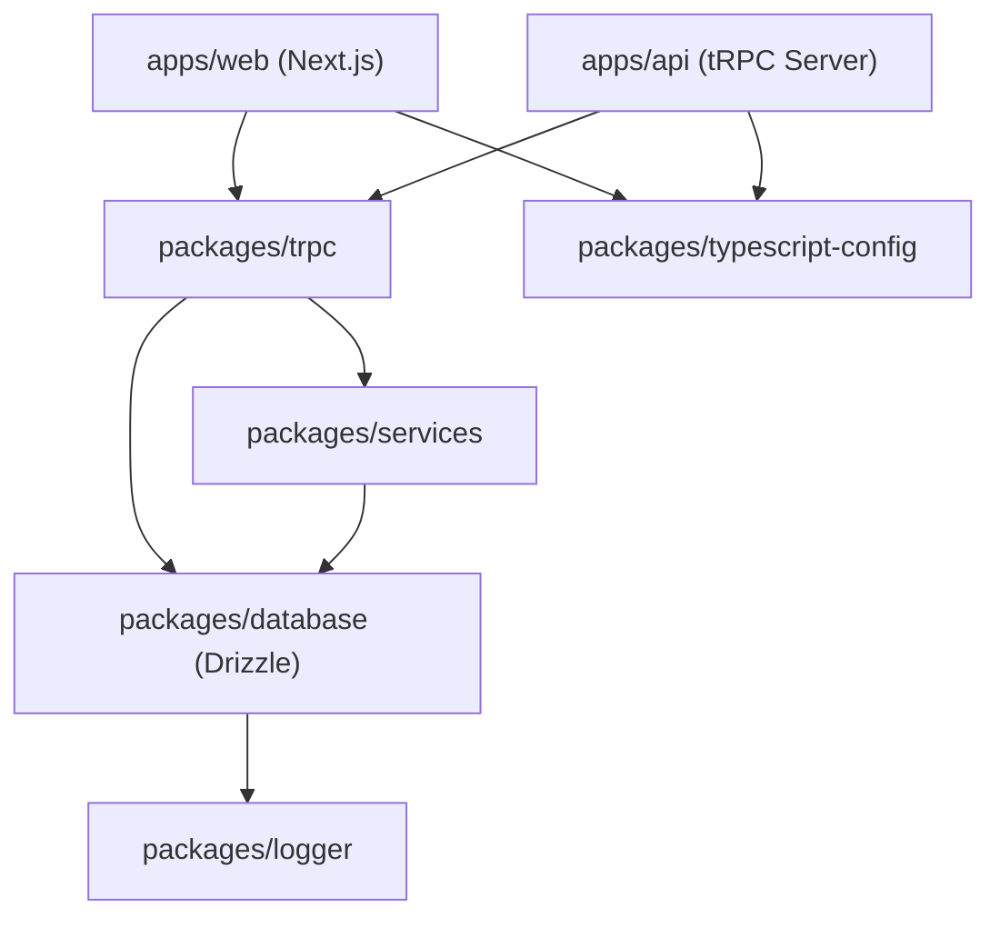

# Workspace Dependency Graph

## Covers
- Hierarchical dependency graph between workspaces
- Compilation ordering boundaries in Turborepo
- Resolution rules for shared npm packages

## Excludes
- Specific Zod schemas or router endpoints
- Dev environmental keys and variables

## 📊 Workspace Dependency Visual
Our Turborepo compile order runs from bottom to top, where packages at the bottom compile first and provide static typing interfaces upward:

<!-- chunk-end -->

## 🧩 Workspace Mapping Details
Every module has a registered workspace name declared in its local `package.json`. These are resolved dynamically by `pnpm`:

### Package Schemas
- `@repo/trpc`: Resolved to `packages/trpc/`. Exports client-side and server-side tRPC types.
- `@repo/database`: Resolved to `packages/database/`. Exports Drizzle schemas, connection pool clients, and migration sets.
- `@repo/services`: Resolved to `packages/services/`. Contains authentication flow clients and third-party integrations.
- `@repo/logger`: Resolved to `packages/logger/`. Exports server pino-logging functions.
<!-- chunk-end -->

## ⚠️ Dependency Invariants
To prevent compilation or circular dependency errors:

### Import Protocols
- **tRPC Isolation**: Do not import `@repo/trpc` inside `@repo/database` or `@repo/services`. `packages/trpc` acts as the top-level API boundary and is the final consumer of database and services.
- **TypeScript Workspace Configs**: All packages must reference the base configurations under `@repo/typescript-config` via the `extends` field in their local `tsconfig.json`.
<!-- chunk-end -->
