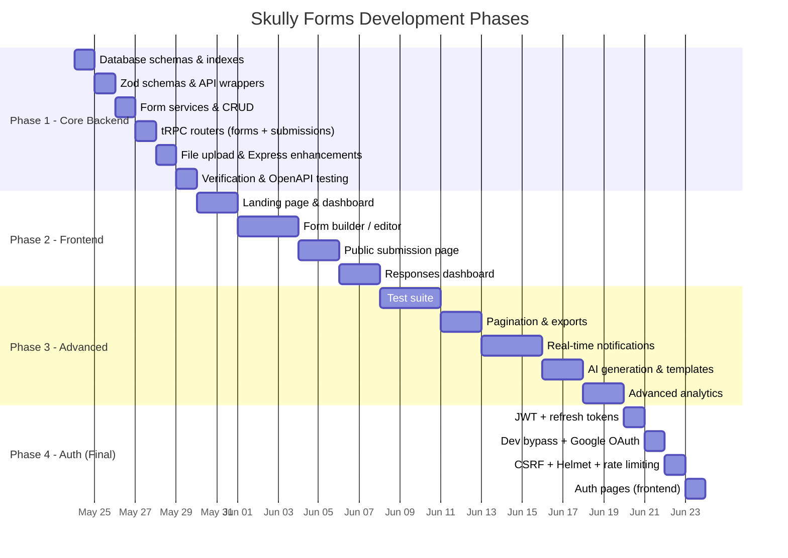

# Skully Forms — Feature Roadmap & Development Plan

A comprehensive, phased development roadmap for Skully Forms. Each feature is categorized by phase, tagged with the review criticisms it addresses, and prioritized by impact.

> [!IMPORTANT]
> **Authentication is deferred to the FINAL phase.** We build all features first using a temporary `x-user-id` header for dev testing. Auth (JWT, CSRF, Helmet, rate limiting, OAuth) is layered on top at the end — zero service refactoring needed.

---

## Legend

| Symbol | Meaning |
|---|---|
| 🔴 | Critical — Must-have for production readiness |
| 🟡 | Important — Significant quality/UX improvement |
| 🟢 | Nice-to-have — Polish, differentiation, delight |
| `[REVIEW-FIX]` | Directly addresses a criticism from the code review |
| `[REVIEW-KEEP]` | Doubles down on a praised pattern from the review |

---

## Phase 1: Core Backend Features (Current Sprint)

> [!NOTE]
> These items are being implemented NOW. No auth — all user-scoped endpoints use `x-user-id` header.

| # | Feature | Priority | Status |
|---|---|---|---|
| 1.1 | Drizzle schemas (`formsTable`, `submissionsTable`) with JSONB fields | 🔴 | Planned |
| 1.2 | Nanoid slug-based public URLs | 🔴 | Planned |
| 1.3 | Proactive database indexes | 🟡 | Planned |
| 1.4 | Strict Zod discriminated union for field type validation | 🔴 | Planned |
| 1.5 | Form CRUD tRPC routers (create, read, update, delete, list) | 🔴 | Planned |
| 1.6 | Public form access by slug | 🔴 | Planned |
| 1.7 | Submission save + retrieval tRPC routers | 🔴 | Planned |
| 1.8 | Basic analytics aggregation (option distribution counts) | 🟡 | Planned |
| 1.9 | File upload endpoint (`POST /api/upload`) with multer | 🔴 | Planned |
| 1.10 | UUID-prefixed flat file storage | 🟡 | Planned |
| 1.11 | Standardized `ApiResponse<T>` / `ApiError` wrappers | 🟡 | Planned |
| 1.12 | Structured pino request logging middleware | 🟡 | Planned |
| 1.13 | Request body size limits (1MB JSON, multer limits) | 🔴 | Planned |
| 1.14 | Domain event hook on submission (no-op, future extensibility) | 🟡 | Planned |
| 1.15 | Zero `as any` policy enforcement | 🟡 | Planned |
| 1.16 | Scalar OpenAPI docs at `/docs` | 🟡 | Existing |

---

## Phase 2: Premium Frontend

> [!IMPORTANT]
> Frontend development begins after Phase 1 backend is fully verified. All pages consume the tRPC routers built in Phase 1. Still uses `x-user-id` header until auth phase.

### 2.1 — Landing Page `[REVIEW-KEEP]`
- **Priority**: 🔴
- **Description**: Premium animated landing page with gradients, micro-animations, product showcases, and CTA to login/signup.
- **Review context**: *"Strong visual polish"* and *"Good landing-page presentation"* were praised — we must exceed this bar.
- **Details**:
  - Outfit Google Font, glassmorphism cards
  - Framer Motion entrance animations
  - Feature showcase grid with hover interactions
  - Temporary dev user selector for testing (replaced with real login in Phase 4)

### 2.2 — Dashboard Page `[REVIEW-KEEP]`
- **Priority**: 🔴
- **Description**: Responsive grid listing all user forms with key statistics.
- **Details**:
  - Form cards showing: title, slug, publish status, submission count, created date
  - "New Form" creation dialog
  - Quick actions: edit, delete, view responses, copy public link
  - Empty state with illustrated placeholder

### 2.3 — Form Builder / Editor Page `[REVIEW-FIX]`
- **Priority**: 🔴
- **Description**: The core workspace for creating and editing form schemas.
- **Review context**: Addresses *"extremely large components (680-line builder)"*, *"manual useState complexity"*, and *"questions rely on array indexes instead of stable IDs"*.
- **Details**:
  - **Left sidebar**: Field type inventory (Text, Textarea, Number, Select, Radio, Checkbox, Date, Email, File)
  - **Center canvas**: Interactive field list with direct inline editing (label, placeholder, required toggle, options management)
  - **Right sidebar**: Theme picker, layout mode toggle (Scroll vs. Slide), form settings
  - **Top bar**: Save indicator, Preview button, Publish toggle
  - **Architecture constraints**:
    - Use stable nanoid field IDs, NOT array indexes
    - Use `react-hook-form` or `useReducer` for state — NOT manual `useState` chains
    - Split into focused sub-components (< 200 lines each)
    - Use shared Zod schemas from `packages/trpc/server/schemas/` for client-side validation

### 2.4 — Public Submission Page `[REVIEW-KEEP]`
- **Priority**: 🔴
- **Description**: The public-facing form that respondents fill out.
- **Review context**: *"Step-by-step UX"*, *"animated progress flow"*, and *"validation layers"* were praised.
- **Details**:
  - Loads theme-specific styles dynamically (Cyberpunk, Sunset, Slate, Forest)
  - **Scroll Mode**: Vertical list of questions with glowing glassmorphism cards
  - **Slide Mode**: Keyboard-navigated (Enter/Arrow keys) single-question slides with progress bar, smooth transitions
  - File upload with preview (image thumbnails, video players), loading spinners
  - Success/thank-you screen with animation

### 2.5 — Responses Dashboard Page `[REVIEW-FIX]`
- **Priority**: 🔴
- **Description**: Analytical dashboard showing all submissions for a form.
- **Review context**: Addresses *"no individual response browsing"* and *"no CSV/PDF export"*.
- **Details**:
  - **Tab 1 — Analytics**: Recharts bar/pie charts for option distribution
  - **Tab 2 — Submissions Table**: Chronological table, click-to-expand individual response detail modal
  - **Tab 3 — File Gallery**: Grid of uploaded media with inline preview/playback

---

## Phase 3: Advanced Features & Hardening

### 3.1 — Automated Test Suite `[REVIEW-FIX]`
- **Priority**: 🔴
- **Addresses**: *"Missing automated tests"* (#1 recurring criticism)
- **Description**: Comprehensive test coverage using Vitest.
- **Scope**:
  - **Unit tests**: All service methods (FormService, UserService, JWT utilities)
  - **Integration tests**: tRPC router procedures with a test PostgreSQL database
  - **Validation tests**: Zod schema edge cases (malformed JSONB, boundary values)
  - **Security tests**: Rate limiting behavior, CSRF rejection, expired token handling
  - **File upload tests**: Size limit enforcement, MIME type validation
- **Target**: 80%+ code coverage on critical paths

### 3.2 — Cursor-Based Pagination `[REVIEW-FIX]`
- **Priority**: 🔴
- **Addresses**: *"Missing pagination/scaling patterns"* (#10 recurring criticism)
- **Description**: Implement cursor-based pagination on all list endpoints.
- **Details**:
  - Use `createdAt` as cursor with configurable `limit` (default 20)
  - tRPC input schemas: optional `{ cursor?: string, limit?: number }`
  - Return `{ items: T[], nextCursor: string | null }` shape
  - Apply to: `getUserForms`, `getSubmissions`

### 3.3 — Anonymous vs Authenticated Submission Modes `[REVIEW-FIX]`
- **Priority**: 🔴
- **Addresses**: *"Response endpoint does not properly enforce anonymous vs authenticated modes"* and *"weak anonymous/authenticated deduplication"*
- **Description**: Per-form configurable submission modes.
- **Details**:
  - Add `submissionMode` column to `formsTable`: `ANONYMOUS`, `AUTHENTICATED`, `BOTH`
  - `ANONYMOUS`: Device fingerprint (hashed IP + User-Agent) stored on submission
  - `AUTHENTICATED`: `userId` stored on submission, require login to submit
  - `BOTH`: Accept either, store whatever identity is available
  - Server-side deduplication: one submission per fingerprint (anon) or per userId (auth) per form
  - Add `respondentId` (nullable UUID) and `deviceFingerprint` (nullable varchar) columns to `submissionsTable`

### 3.4 — Graceful Server Shutdown
- **Priority**: 🟡
- **Addresses**: *"Weak operational hygiene (env handling, shutdowns, memory leaks)"*
- **Description**: Clean shutdown on `SIGTERM`/`SIGINT`.
- **Details**:
  - Stop accepting new connections
  - Wait for in-flight requests (10-second timeout)
  - Close database pool (`pg` pool.end())
  - Log shutdown lifecycle via `@repo/logger`

### 3.5 — Service Layer Granularity `[REVIEW-FIX]`
- **Priority**: 🟡
- **Addresses**: *"Extremely large components"* and *"large monolithic UI components"*
- **Description**: Refactor `FormService` into focused sub-modules once it exceeds 200 lines.
- **Proposed split**:
  - `FormCrudService` — create, update, delete, get
  - `FormPublicService` — public access, slug resolution
  - `SubmissionService` — submit, list, deduplicate
  - `AnalyticsService` — aggregation, trends, exports
- **Trigger**: Refactor when any single service file exceeds 200 lines

### 3.6 — CSV / PDF Export `[REVIEW-FIX]`
- **Priority**: 🟡
- **Addresses**: *"No CSV/PDF export"*
- **Description**: Allow form creators to download all submissions as CSV or PDF.
- **Details**:
  - `GET /forms/:formId/export?format=csv` — streams CSV with headers matching field labels
  - `GET /forms/:formId/export?format=pdf` — generates PDF summary using `pdfkit` or similar
  - Include file upload URLs as hyperlinks in exports

### 3.7 — Individual Response Browsing `[REVIEW-FIX]`
- **Priority**: 🟡
- **Addresses**: *"No individual response browsing"*
- **Description**: Detailed view for a single submission.
- **Details**:
  - `GET /forms/:formId/submissions/:submissionId` — returns full submission data
  - Frontend: slide-out modal or dedicated page showing each question + answer pair
  - Render uploaded images inline, video with player controls

### 3.8 — Time-Series / Trend Analytics `[REVIEW-FIX]`
- **Priority**: 🟡
- **Addresses**: *"No time-series/trend analytics"*
- **Description**: Show submission volume over time.
- **Details**:
  - Aggregate submissions by hour/day/week/month
  - Return time-bucketed counts for Recharts line/area charts
  - `GET /forms/:formId/analytics/trends?bucket=day&range=30d`

### 3.9 — Drop-Off Analytics `[REVIEW-FIX]`
- **Priority**: 🟢
- **Addresses**: *"No drop-off analytics"*
- **Description**: For slide-mode forms, track where respondents abandon the form.
- **Details**:
  - Track `lastCompletedFieldIndex` on partial submissions (saved on page unload via `sendBeacon`)
  - Aggregate into a funnel visualization showing completion rates per question
  - Requires new `partialSubmissionsTable` or a `completed` boolean on `submissionsTable`

### 3.10 — Real-Time Submission Notifications `[REVIEW-FIX]` `[REVIEW-KEEP]`
- **Priority**: 🟡
- **Addresses**: *"No socket authentication"*, *"any client can join any room"*, *"no reconnect handling"*
- **Praises kept**: *"Redis pub/sub bridge"*, *"room-based websocket architecture"*, *"realtime analytics propagation"*
- **Description**: Live notifications when new submissions arrive.
- **Details**:
  - Socket.IO server integrated into Express
  - **Authenticated rooms**: Clients join `form:{formId}` rooms only after JWT verification
  - **Events**: `submission:new`, `submission:count-update`
  - **Architecture**: The domain event hook from Phase 1 (`onSubmissionCreated`) is replaced with a real Redis pub/sub emit
  - **Reconnection**: Exponential backoff with jitter on the client
  - **Debouncing**: Batch rapid submissions into 1-second windows

### 3.11 — Form Templates / Library `[REVIEW-FIX]`
- **Priority**: 🟢
- **Addresses**: *"No form library"*
- **Description**: Pre-built form templates users can clone.
- **Details**:
  - System-defined templates: Feedback Survey, Event RSVP, Contact Form, Job Application, Quiz
  - Each template is a predefined `fields` JSONB structure
  - `POST /forms/from-template` — clones template into user's forms with customizable title
  - Future: user-created shareable templates

### 3.12 — AI-Assisted Form Generation `[REVIEW-KEEP]`
- **Priority**: 🟢
- **Praises kept**: *"AI-assisted poll generation"*
- **Description**: Generate form fields from a natural language description.
- **Details**:
  - `POST /forms/generate` — accepts a text prompt (e.g., "Create a customer feedback survey with 5 questions")
  - Uses OpenAI/Gemini API to generate a valid `formFieldsArraySchema`-compliant JSONB payload
  - User reviews and edits the generated fields in the builder
  - Requires API key configuration

### 3.13 — Drag-and-Drop Field Reordering `[REVIEW-FIX]`
- **Priority**: 🟡
- **Addresses**: *"Manual useState complexity"* in the builder
- **Description**: Drag to reorder fields in the form builder.
- **Details**:
  - Use `@dnd-kit/sortable` for accessible, performant drag-and-drop
  - Field order is determined by array position in `fields` JSONB
  - Smooth animations during reorder

### 3.14 — Form Duplication
- **Priority**: 🟢
- **Description**: Clone an existing form (including all fields) as a new draft.
- **Details**:
  - `POST /forms/:formId/duplicate` — copies form with new slug, resets publish status
  - Useful for iterating on form designs

### 3.15 — Auth vs Anonymous Analytics Breakdown `[REVIEW-FIX]`
- **Priority**: 🟢
- **Addresses**: *"No auth vs anonymous breakdown"*
- **Description**: In the analytics dashboard, segment responses by authenticated vs anonymous.
- **Details**:
  - Group submission counts and option distributions by respondent type
  - Visual toggle in the analytics UI to filter by segment

### 3.16 — Peak Activity Metrics `[REVIEW-FIX]`
- **Priority**: 🟢
- **Addresses**: *"No peak activity metrics"*
- **Description**: Show busiest hours/days for submissions.
- **Details**:
  - Heatmap visualization of submission frequency by hour-of-day and day-of-week
  - `GET /forms/:formId/analytics/peak`

### 3.17 — Form Health & Duration Metrics `[REVIEW-FIX]`
- **Priority**: 🟢
- **Addresses**: *"No poll health/duration metrics"*
- **Description**: Track average form completion time.
- **Details**:
  - Record `startedAt` timestamp (when form first loads) and `completedAt` (on submit)
  - Calculate average, median, p95 completion duration
  - Surface in analytics dashboard

### 3.18 — Webhooks on Submission `[REVIEW-KEEP]`
- **Priority**: 🟢
- **Description**: Allow form creators to configure a webhook URL that receives a POST payload on every new submission.
- **Details**:
  - Add `webhookUrl` column to `formsTable`
  - On submission, fire async POST to webhook URL with submission data
  - Retry with exponential backoff (3 attempts)
  - Log webhook delivery status

### 3.19 — Docker Compose for Full Stack `[REVIEW-KEEP]`
- **Priority**: 🟡
- **Praises kept**: *"Dockerized infrastructure"*
- **Description**: Expand existing `docker-compose.yml` to include API server, web app, and PostgreSQL.
- **Details**:
  - Multi-stage Dockerfile for `apps/api` and `apps/web`
  - Health checks, volume mounts for uploads
  - `docker compose up` for one-command local setup

---

## Phase 4: Authentication & Security Hardening (FINAL)

> [!IMPORTANT]
> Authentication is added LAST as a non-disruptive layer. The `x-user-id` dev header is replaced with JWT cookie extraction in `context.ts`. No service layer or router logic changes — only the identity resolution mechanism changes.

### 4.1 — JWT Access + Refresh Token Rotation `[REVIEW-KEEP]`
- **Priority**: 🔴
- **Praises kept**: *"JWT access + refresh architecture"*, *"auto-refresh interceptor"*
- **Description**: Secure HTTP-only cookie-based JWT sessions.
- **Details**:
  - Access token: 15-minute expiry, signed with `JWT_ACCESS_SECRET`
  - Refresh token: 30-day expiry, signed with `JWT_REFRESH_SECRET`
  - Both stored as HTTP-only, Secure, SameSite=Lax cookies
  - `POST /authentication/refresh` — verify refresh, issue new access token
  - Replace `x-user-id` header extraction in `context.ts` with JWT cookie verification

### 4.2 — Developer Bypass Login
- **Priority**: 🔴
- **Description**: Instant login for local development without OAuth credentials.
- **Details**:
  - `POST /authentication/developer-login` — accepts `{ email, fullName }`
  - Creates/finds user via `findOrCreateUser`
  - Issues access + refresh + CSRF cookies
  - Only available when `NODE_ENV !== 'production'`

### 4.3 — Google OAuth Complete Flow `[REVIEW-KEEP]`
- **Priority**: 🔴
- **Praises kept**: *"Google OAuth with PKCE"*, *"comprehensive auth system"*
- **Description**: Full Google OAuth login flow.
- **Details**:
  - Google OAuth callback handler in Express
  - Exchange authorization code for Google tokens
  - Extract user profile (email, name, avatar)
  - Call `findOrCreateUser`, issue JWT cookies
  - Frontend Google login button

### 4.4 — CSRF Double-Submit Cookie Protection `[REVIEW-FIX]`
- **Priority**: 🔴
- **Addresses**: *"No CSRF protection on response submission"*
- **Description**: Stateless CSRF protection for all mutating endpoints.
- **Details**:
  - On login, set `csrfToken` cookie (non-httpOnly so JS can read it)
  - Client sends token in `X-CSRF-Token` header with every POST/PATCH/DELETE
  - Server middleware validates header matches cookie

### 4.5 — Helmet Security Headers `[REVIEW-FIX]`
- **Priority**: 🔴
- **Addresses**: *"No Helmet/security headers"*
- **Description**: Comprehensive HTTP security headers.
- **Details**:
  - X-Content-Type-Options, X-Frame-Options, X-XSS-Protection
  - Content-Security-Policy, Referrer-Policy
  - Single `helmet()` middleware call

### 4.6 — Express Rate Limiting `[REVIEW-FIX]`
- **Priority**: 🔴
- **Addresses**: *"No rate limiting on auth endpoints"*, *"No rate limiting on API endpoints overall"*
- **Description**: IP-based rate limiting on all public-facing endpoints.
- **Details**:
  - `/api/public/*` — 10 requests/minute per IP
  - `/api/upload` — 5 requests/minute per IP
  - `/api/authentication/*` — 5 requests/minute per IP
  - Uses `express-rate-limit`

### 4.7 — Auth Pages (Frontend)
- **Priority**: 🔴
- **Description**: Login/signup pages.
- **Details**:
  - Google OAuth PKCE button
  - Developer bypass form (email + name)
  - Auto-redirect on existing session
  - Replace dev user selector from Phase 2

### 4.8 — Logout Flow
- **Priority**: 🔴
- **Description**: Clean session termination.
- **Details**:
  - `POST /authentication/logout` — clears access, refresh, and CSRF cookies
  - Frontend redirect to landing page

---

## Architecture Quality Principles

> These principles apply across ALL phases. They are non-negotiable code quality standards derived from the review analysis.

### Enforced Now (Phase 1+)
| Principle | Addresses |
|---|---|
| Zero `as any` — use generics, Zod `.infer<>`, proper narrowing | *"27 `as any` assertions"* |
| No `console.log` — use `@repo/logger` exclusively | *"Debug console.log statements committed"* |
| Shared Zod schemas as single source of truth | *"Inconsistent frontend/backend validation schemas"* |
| Stable nanoid IDs for fields, NOT array indexes | *"Questions rely on array indexes"* |
| Standardized `ApiResponse<T>` / `ApiError` wrappers | *"Clean ApiError/ApiResponse abstractions"* (keep) |
| All env vars validated via Zod on startup | *"Weak operational hygiene (env handling)"* |

### Enforced from Phase 2+
| Principle | Addresses |
|---|---|
| No component file > 200 lines — split into focused sub-components | *"Extremely large components (680-line builder)"* |
| No duplicated logic — extract to shared utilities | *"Duplicated share logic across files"* |
| No dead/experimental code in production branch | *"Dead components with duplicated replacements"* |
| Use form abstractions (`react-hook-form`) not raw `useState` | *"Manual useState complexity"*, *"No form abstraction library"* |
| Framer Motion for all transitions | *"Framer Motion animations"* (keep) |

---

## Summary Matrix

